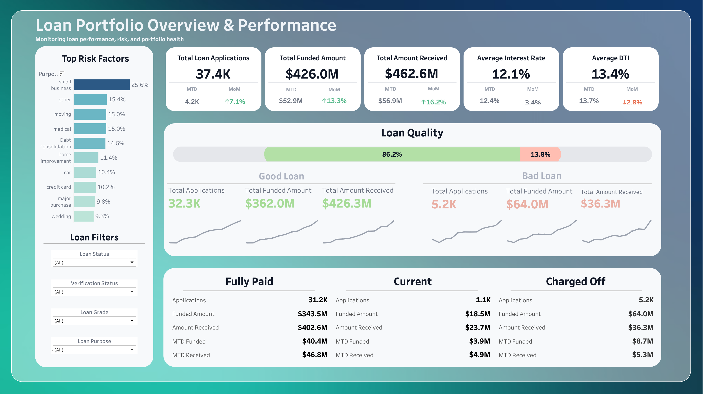
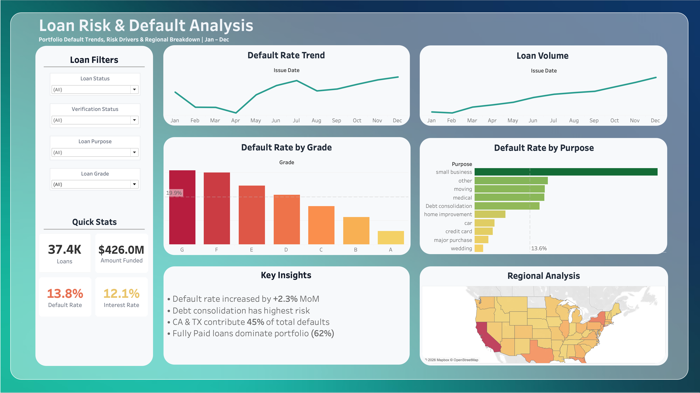

# Loan Portfolio Risk Analysis

An interactive Tableau dashboard suite analyzing loan portfolio performance and default risk across 38,000+ loan applications, built to support data-driven risk evaluation.

## Overview

This self-initiated project explores loan portfolio health from two angles: **overall performance** (funding, repayment, loan quality) and **risk and default behavior** (default drivers, trends over time, and regional patterns). The goal was to turn a large, raw loan dataset into an executive-level view that surfaces risk drivers a lender could act on.

## Dashboards

### 1. Loan Portfolio Overview & Performance


- KPI summary cards for total applications, funded amount, amount received, average interest rate, and average debt-to-income (DTI) ratio, each with month-to-date and month-over-month comparisons
- Good Loan vs. Bad Loan segmentation with trend sparklines for applications, funded amount, and amount received
- Loan status breakdown (Fully Paid, Current, Charged Off) with funded and received totals for each
- "Top Risk Factors" panel ranking loan purpose by share of risk
- Interactive filters for Loan Status, Verification Status, Loan Grade, and Loan Purpose

### 2. Loan Risk & Default Analysis


- Default rate trend across the year (Jan–Dec)
- Loan volume trend across the year
- Default rate by loan grade (A–G), color-coded by severity
- Default rate by loan purpose
- Regional analysis of defaults by state
- Key Insights panel summarizing the standout findings

## Key Findings
- Overall loan quality: 86.2% of loans are classified as "Good Loan," with a 13.8% default rate across the portfolio
- Small business loans carry the highest risk, accounting for 25.6% of top risk factors
- Default rate increased 2.3% month-over-month
- Debt consolidation loans carry the highest default risk among loan purposes
- California and Texas together account for 45% of total defaults
- Fully paid loans make up 62% of the portfolio

## Tools & Skills
- **Tableau** — dashboard design, calculated fields, interactive filtering, cross-filtering actions
- **SQL** — data querying and preparation
- **Excel** — supplementary data cleaning and validation
- Calculated KPIs: Default Rate, Good Loan Ratio, Approval Rate (86.2%)
- Multi-dimensional segmentation across borrower attributes (Purpose, Grade, Verification Status, Term)
- UI/UX design principles applied to layout, spacing, and color for data storytelling

## Sample SQL

```sql
-- Month-to-date total loan applications
SELECT COUNT(id) AS MTD_Total_Loan_Applications
FROM sales
WHERE strftime('%m', issue_date) = '12'
  AND strftime('%Y', issue_date) = '2021';

-- Good loan percentage (Fully Paid or Current status)
SELECT (COUNT(CASE WHEN loan_status = 'Fully Paid' OR loan_status = 'Current' THEN id END) * 100.0) / COUNT(id)
       AS Good_Loan_Percentage
FROM sales;

-- Total amount collected in December
SELECT SUM(total_payment) AS Total_Amount_Collected
FROM sales
WHERE strftime('%m', issue_date) = '12';
```

## Data Source
Dataset: [Financial Loan Dataset](https://www.kaggle.com/datasets/datawitharyan/financial-loan-dataset) (Kaggle)

## Dataset
38,000+ loan applications, including fields such as loan purpose, grade, verification status, term, funded amount, amount received, interest rate, DTI, and loan status. SQL was used to clean and prepare the raw data before building the dashboards in Tableau.

## Author
Aamna Kamal — [linkedin.com/in/aamna-kamal](https://www.linkedin.com/in/aamna-kamal)
